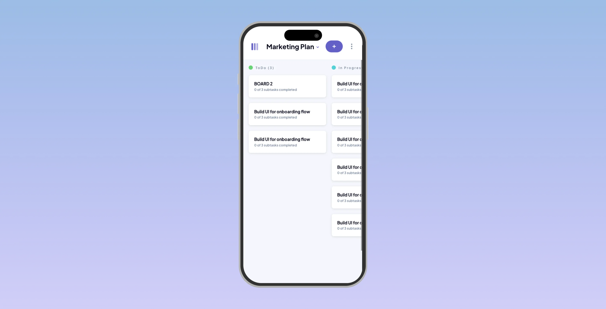

# Karoz


Karoz is a Kanban project management application designed to streamline project flow management. It enables users to effortlessly create boards and organize tasks into customizable columns, enhancing workflow efficiency. The app is user-friendly, offering features like user authentication, board customization, and a responsive design suitable for both desktop and mobile use.

* **User Authentication:** Secure login using Firebase, ensuring data safety and user privacy.
* **Board Creation:** Easily create boards with customizable columns, tasks, and subtasks to fit your project needs.
* **Mobile Responsive:** Karoz is fully responsive, providing an optimal experience on both desktop and mobile devices.
* **Dark Mode:** A user-friendly dark mode for comfortable viewing in different lighting conditions.

<p align="center">
  
</p>

This snapshot illustrates the user-friendly interface, highlighting the easily navigable board layout. Customize your workflow with tasks and columns, effortlessly adapting to the unique demands of your project.

<p align="center">

</p>

This streamlined interface allows for the quick creation and editing of tasks, complete with detailed descriptions and sub-tasks. Tailor each task to your project's needs with ease, ensuring a comprehensive and organized approach to your workflow.

<p align="center">
  
</p>

Navigate through Karoz's robust authentication process on the login/signup page, designed with security and technical efficiency in mind. This interface integrates Firebase's advanced authentication mechanisms, offering a secure entry point to a personalized project management experience. 

<p align="center">
  
</p>

Karoz's mobile version exemplifies responsive design, adapting seamlessly to smaller screens without sacrificing functionality. This view showcases an optimized interface for on-the-go task management, maintaining full feature accessibility and user experience from the desktop version.

<p align="center">
  
</p>

For a less straining and more visually appealing UI during extended usage, dark mode not only adds an aesthetic touch but also enhances usability in low-light environments.


[GitHub action]: https://github.com/andresz1/size-limit-action
[Statoscope]:    https://github.com/statoscope/statoscope
[cult-img]:      http://cultofmartians.com/assets/badges/badge.svg
[cult]:          http://cultofmartians.com/tasks/size-limit-config.html

## How It Works

* **React.js Frontend:** Delivers a dynamic user interface with efficient rendering, ensuring a smooth and responsive experience.
* **Context API for State Management:** Simplifies state management across the application, allowing for efficient data flow without complex prop-drilling.
* **Firebase Integration:** Provides robust backend services, including secure user authentication and real-time database interactions for seamless data syncing and storage.
* **Responsive Design:** Fully adaptable to various devices and screen sizes, ensuring a consistent and accessible experience across desktop and mobile platforms.
* **Dark Mode Implementation:** Offers an eye-friendly alternative UI, catering to user preferences and different lighting conditions.


## Usage

Karoz is designed to be intuitive and user-friendly. Here's a guide to help you get started and make the most out of the application.

1. Installation:

    ```sh
    git clone git@github.com:oalva-rez/karoz.git
    ```

2. Navigate to the project directory and install dependencies.:

     ```sh
    npm install
    ```

3. Setting Up Firebase Authentication:

    * Ensure you have your Firebase authentication tokens.
    * Configure the Firebase settings in the application as per the documentation.


### Using Karoz

1. Logging In/Signing Up:

    * Open Karoz and navigate to the login/signup page.
    * Use your credentials to log in, or sign up if you're a new user.
    * **NOTE:** Email and password not yet impleneted, only Google Auth works.

2. Creating a Board:

    * Once logged in, click on ‘Create Board’ to start a new project.
    * Name your board and customize its columns (e.g., To Do, In Progress, Done).

3. Adding Tasks:

    * Within a board, click on ‘Add Task’ to create a new task.
    * Provide details for the task, including description and subtasks.
